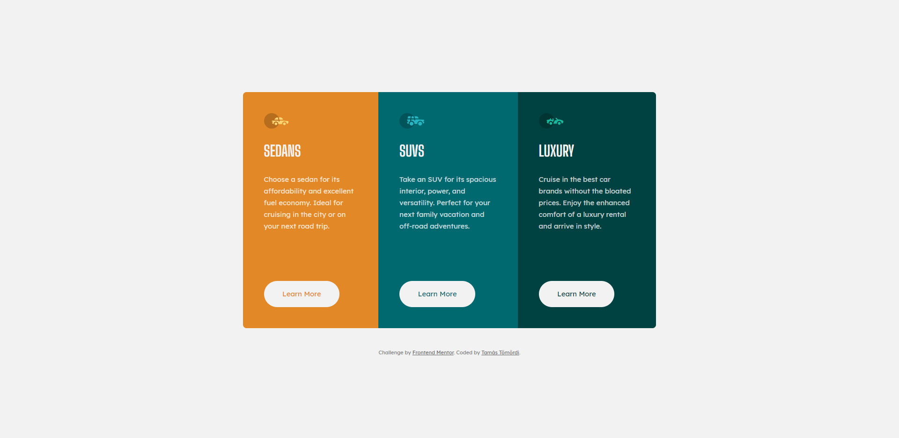

# Frontend Mentor - 3-column preview card component solution

This is a solution to the [3-column preview card component challenge on Frontend Mentor](https://www.frontendmentor.io/challenges/3column-preview-card-component-pH92eAR2-). Frontend Mentor challenges help you improve your coding skills by building realistic projects. 

## Table of contents

- [Overview](#overview)
  - [The challenge](#the-challenge)
  - [Screenshot](#screenshot)
  - [Links](#links)
- [Built with](#built-with)
- [Author](#author)

## Overview

### The challenge

Users should be able to:

- View the optimal layout depending on their device's screen size
- See hover states for interactive elements

### Screenshot

### Links

- [GitHub project URL](https://github.com/tamastomordi/3-column-preview-card-component)
- [Live site URL](https://gifted-wescoff-4e5ea5.netlify.app)

## Built with

- Semantic HTML5 markup
- CSS custom properties
- Flexbox
- Mobile-first workflow
- [Modern CSS Reset](https://github.com/andy-piccalilli/modern-css-reset) by Andy Piccalilli

## Author

- Website - [Tamás Tömördi](https://www.tomordi.com)